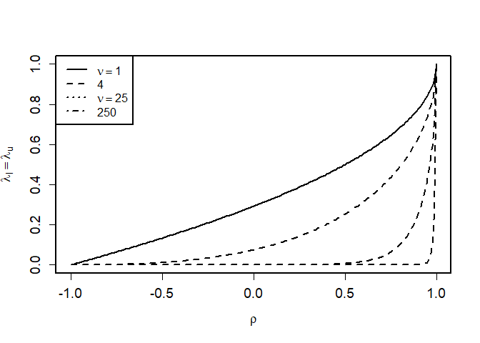

Statatistics and Data Analysis for Financial Engineering - Chapter 8
Copulas
================

data and code from the book can be found here:
<https://people.orie.cornell.edu/davidr/SDAFE2/>

## Archimedean Copulas

Archimedean copula with generator function:

 = \phi^{-1}(\phi(u_1)+..+\phi(u_d))
")

#### Frank copula

Generator function:

 = -ln(\frac{e^{-\theta u} -1)}{e^{-\theta} -1)}), -\infty < \theta < \infty
")

#### Crayton copula

Generator function:

 = \frac{1}{\theta}(u^{-\theta}-1), \theta > 0
")

#### Gumbel Copula adsfads

Generator function:

 = -ln(u)^{\theta}, \theta \geq 1
")

#### Joe copula

Generator function:

 = -ln(1-(1-\theta)^{\theta}), \theta \geq 1
")

### Plot of generator function for Frank cupola

``` r
library(copula)
u= seq(0.000001, 1, length=500)
frank = iPsi(copula=archmCopula(family="frank", param=1), u)
plot(u, frank, type="l", lwd=3, ylab=expression(phi(u)))
abline(h=0)
abline(v=0)
```

<!-- -->

### Scatter plot of 9 bivariate Frank copulas

``` r
set.seed(5640)
theta = c(-100, -50, -10, -1, 0, 5, 20, 50, 500)
par(mfrow=c(3,3), cex.axis=1.2, cex.lab=1.2, cex.main=1.2)
for(i in 1:9){
  U= rCopula(n=200, copula=archmCopula(family="frank", param=theta[i]))
  plot(U, xlab=expression(u[1]), ylab=expression(u[2]), 
                          main=eval(substitute(expression(paste(theta, " = ", j)),
                         list(j = as.character(theta[i])))))
}
```

    ## parameter at boundary ==> returning indepCopula()

<!-- -->
Figure 2: Bivariate random samples of size 200 from various Frank
copulas.

### Scatter plot of 9 bivariate Clayton copulas

<!-- -->
Figure 3: Bivariate random samples of size 200 from various clayton
copulas.

### Scatter plot of 6 bivariate Gumbel copulas

<!-- -->
Figure 4: Bivariate random samples of size 200 from various gumbel
copulas.

### Scatter plot of 6 bivariate Joe copulas

<!-- -->
Figure 4: Bivariate random samples of size 200 from various joe copulas.

## Rank correlation: 1. Kendall’s Tau, 2. Spearman’s rank correlation coefficient

## Tail dependence

``` r
rho = seq(-1, 1, by=0.01)
df = c(1,4,25, 240)
x1 = -sqrt((df[1]+1)*(1-rho)/(1+rho))
lambda1 = 2*pt(x1, df[1]+1)
x4 = -sqrt((df[2]+1)*(1-rho)/(1+rho))
lambda4 = 2*pt(x4, df[2]+1)
x25 = -sqrt((df[3]+1)*(1-rho)/(1+rho))
lambda25 = 2*pt(x25, df[3]+1)
x250 = -sqrt((df[4]+1)*(1-rho)/(1+rho))
lambda250 = 2*pt(x250, df[4]+1)
par(mfrow=c(1,1), lwd=2, cex.axis=1.2, cex.lab=1.2)
plot(rho, lambda1, type="l", lty=1, xlab=expression(rho), ylab=expression(lambda[l]==lambda[u]))
lines(rho, lambda4, lty=2)
lines(rho, lambda25, lty=2)
lines(rho, lambda250, lty=2)
legend("topleft", c( expression(nu==1), expression(nu=4), expression(nu==25), expression(nu=250) ), lty=1:4)
```

<!-- -->

``` r
getwd()
```

    ## [1] "C:/prosjekt/Statistics-and-Data-Analysis-for-Financial-Engineering-Copulas"

## Example: flows in pipeline

``` r
library(copula)
library(sn)
```

    ## Loading required package: stats4

    ## 
    ## Attaching package: 'sn'

    ## The following object is masked from 'package:stats':
    ## 
    ##     sd

``` r
dat = read.csv("datasets/FlowData.csv")
dat = dat/10000
n = nrow(dat)
x1 = dat$Flow1
fit1 = st.mple(matrix(1,n,1), y=x1, dp=c(mean(x1), sd(x1),0,10))
est1 = fit1$dp              #vector or list of estimated DP parameters
u1 = pst(x1, dp=est1)       # vector of probabililities - skew-t
x2 = dat$Flow2
fit2 = st.mple(matrix(1,n,1), y=x2, dp=c(mean(x2), sd(x2),0,10))
est2 = fit2$dp
u2 = pst(x2, dp=est2)
U.hat = cbind(u1,u2)
z1 = qnorm(u1)
z2 = qnorm(u2)
Z.hat = cbind(z1,z2)
```

``` r
library(ks) 
```

    ## 
    ## Attaching package: 'ks'

    ## The following object is masked from 'package:sn':
    ## 
    ##     vech

``` r
fhatU = kde(x=U.hat, H=Hscv(x=U.hat))
par(mfrow=c(2,2), cex.axis=1.2, cex.lab=1.2, cex.max=1.2)
```

    ## Warning in par(mfrow = c(2, 2), cex.axis = 1.2, cex.lab = 1.2, cex.max = 1.2):
    ## "cex.max" is not a graphical parameter

``` r
hist(u1, main="(a)", xlab=expression(hat(U)[1]), freq=FALSE)
hist(u1, main="(b)", xlab=expression(hat(U)[2]), freq=FALSE)
plot(u1, u2, main="(c)", xlab = expression(hat(U)[1]), ylab = expression(hat(U)[2]), mgp = c(2.5, 1, 0))
plot(fhatU, drawpoints=FALSE, drawlabels=FALSE, cont=seq(10, 80, 10), 
     main="(d)", xlab=expression(hat(U)[1]), ylab=expression(hat(U)[2]), mgp = c(2.5, 1, 0)) 
```

<!-- --> Figure 6:
Pipeline data. Density histograms (a), and (b) and a scatterplot (c) of
the uniform-transformed flows. The empirical copula C.hat, is the
empirical CDF of the data in (c). Contours (d) from an estimated copula
density c.hat via a two-dimensional KDE of (c)

``` r
fhatZ = kde(x=Z.hat, H=Hscv(x=Z.hat))

#pdf("norm_flows_hist_plot.pdf", width=7, height=7)
#
par(mfrow=c(2,2), cex.axis=1.2, cex.lab=1.2, cex.main=1.2)
qqnorm(z1, datax=T, main="(a)") ; qqline(z1)
qqnorm(z2, datax=T, main="(b)") ; qqline(z2)
plot(z1, z2, main="(c)", xlab = expression(hat(Z)[1]), ylab = expression(hat(Z)[2]), mgp = c(2.5, 1, 0))
plot(fhatZ, drawpoints=FALSE, drawlabels=FALSE, cont=seq(10, 90, 10), 
     main="(d)", xlab=expression(hat(Z)[1]), ylab=expression(hat(Z)[2]), mgp = c(2.5, 1, 0)) 
```

<!-- --> Figure 7:
Pipeline date. Normal quantile plots (a) and (b), a scatterplot (c) and
KDE density countours from the normal-transformed flows.

``` r
options(digits=3)
cor.test(u1, u2, method="spearman")
```

    ## Warning in cor.test.default(u1, u2, method = "spearman"): Cannot compute exact
    ## p-value with ties

    ## 
    ##  Spearman's rank correlation rho
    ## 
    ## data:  u1 and u2
    ## S = 9e+06, p-value = 1e-11
    ## alternative hypothesis: true rho is not equal to 0
    ## sample estimates:
    ##    rho 
    ## -0.357

``` r
cor.test(u1, u2, method="kendall")
```

    ## 
    ##  Kendall's rank correlation tau
    ## 
    ## data:  u1 and u2
    ## z = -7, p-value = 3e-11
    ## alternative hypothesis: true tau is not equal to 0
    ## sample estimates:
    ##    tau 
    ## -0.242

``` r
sin(-0.242*pi/2)
```

    ## [1] -0.371

``` r
cor.test(u1, u2, method="pearson")
```

    ## 
    ##  Pearson's product-moment correlation
    ## 
    ## data:  u1 and u2
    ## t = -7, df = 340, p-value = 8e-12
    ## alternative hypothesis: true correlation is not equal to 0
    ## 95 percent confidence interval:
    ##  -0.448 -0.263
    ## sample estimates:
    ##    cor 
    ## -0.359

``` r
cor.test(z1, z2, method="pearson")
```

    ## 
    ##  Pearson's product-moment correlation
    ## 
    ## data:  z1 and z2
    ## t = -7, df = 340, p-value = 2e-10
    ## alternative hypothesis: true correlation is not equal to 0
    ## 95 percent confidence interval:
    ##  -0.426 -0.238
    ## sample estimates:
    ##    cor 
    ## -0.335

Table 1: Estimates of copula parameters, maximized log-likelihood, and
AIC using the uniform-transfomred pipline flow data.

Next: fitting the paramteric pseudo-maximum likelihood: Btw how lazy is
this code in the text-book! .Last.value is such a hack.

``` r
library(knitr)
omega = -0.371

options(digits=4)

Ct = fitCopula(copula=tCopula(dim = 2), data=U.hat, method="ml", start=c(omega, 10)) 
#Ct@estimate
mle_t = loglikCopula(param=Ct@estimate, U.hat, copula=tCopula(dim = 2))
t_AIC = -2*mle_t + 2*length(Ct@estimate)
#
Cgauss = fitCopula(copula=normalCopula(dim = 2), data=U.hat, method="ml", start=c(omega)) 
#Cgauss@estimate
mle_g = loglikCopula(param=Cgauss@estimate, U.hat, copula=normalCopula(dim = 2))
g_AIC = -2*mle_g + 2*length(Cgauss@estimate)
# Not run
Cgu = fitCopula(copula=gumbelCopula(2, dim=2), data=U.hat, method="ml")
```

    ## Warning in .local(copula, tau, ...): For the Gumbel copula, tau must be >= 0.
    ## Replacing negative values by 0.

    ## Warning in fitCopula.ml(copula, u = data, method = method, start = start, :
    ## optim(*, hessian=TRUE) failed: non-finite finite-difference value [1]

``` r
# Not run
Cjoe = fitCopula(copula=joeCopula(2, dim=2), data=U.hat, method="ml")
```

    ## Warning in .local(copula, tau, ...): For the Joe copula, tau must be >= 0.
    ## Replacing negative values by 0.

    ## Warning in .local(copula, tau, ...): optim(*, hessian=TRUE) failed: non-finite
    ## finite-difference value [1]

``` r
#
Cfr = fitCopula(copula=frankCopula(1, dim=2), data=U.hat, method="ml")
#Cfr@estimate
mle_f = loglikCopula(param=Cfr@estimate, U.hat, copula=frankCopula(dim = 2))
f_AIC = -2*mle_f + 2*length(Cfr@estimate)
#
Ccl = fitCopula(copula=claytonCopula(1, dim=2), data=U.hat, method="ml")
#Ccl@estimate
mle_c = loglikCopula(param=Ccl@estimate, U.hat, copula=claytonCopula(dim = 2))
c_AIC = -2*mle_c + 2*length(Ccl@estimate)

# Put the data in a dataframe:
df <- data.frame(CopulaFamily=rep(c('t', 't', 'Gaussian', 'Frank', 'Clayton')),
        estimates_hat=c(Ct@estimate[1], Ct@estimate[2], Cgauss@estimate,  Cfr@estimate,Ccl@estimate[1]),
         maximized_ll=c(mle_t, '', mle_g, mle_f, mle_c),
         AIC=c(t_AIC, '', g_AIC, f_AIC, c_AIC))
print(df, digits = 2 )
```

    ##   CopulaFamily estimates_hat     maximized_ll               AIC
    ## 1            t         -0.34 20.9827276503404 -37.9654553006808
    ## 2            t         22.44                                   
    ## 3     Gaussian         -0.33 20.3605696065537 -38.7211392131074
    ## 4        Frank         -2.25 23.0677713000729 -44.1355426001458
    ## 5      Clayton         -0.17 9.87084326445845 -17.7416865289169

``` r
#kbl(df)
```
