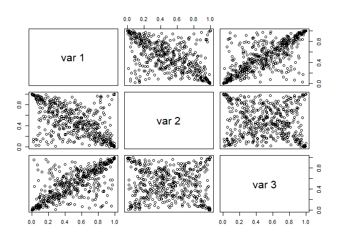
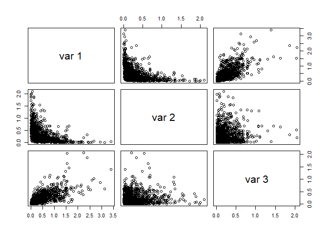
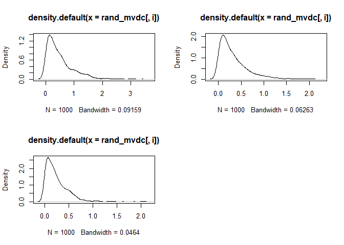

Statatistics and Data Analysis for Financial Engineering - Chapter 8
Copulas
================

``` r
library(copula)
cop_t_dim3 = tCopula(dim=3, param=c(-0.6,0.75,0), dispstr="un", df=1)
set.seed(5640)
rand_t_cop = rCopula(n=500, copula=cop_t_dim3)
pairs(rand_t_cop)
```

<!-- -->

``` r
cor(rand_t_cop)
```

    ##            [,1]        [,2]        [,3]
    ## [1,]  1.0000000 -0.54999514  0.70707296
    ## [2,] -0.5499951  1.00000000 -0.06538499
    ## [3,]  0.7070730 -0.06538499  1.00000000

### Problem1:  

1.  What copula model has been sampled? Give the correlation matrix?  

t-copula, degrees of freedom 1, correlation matrix is:

``` r
cor = matrix(1:9, nrow = 3, ncol = 3)
cor[1,] = c(1, -0.6, 0.75)
cor[2,] = c(-0.6, 1, 0)
cor[3,] = c(0.75, 0, 1)
print(cor)
```

    ##       [,1] [,2] [,3]
    ## [1,]  1.00 -0.6 0.75
    ## [2,] -0.60  1.0 0.00
    ## [3,]  0.75  0.0 1.00

2.  What is the sample size? 500  

### problem 2: scatterplot: 

1.  Components 2 and 3 are uncorrelated. Do they appear independent?
    Why?

A: The scatterplots would have been uniformly distributed if they where
independent, which they are not.   

2.  Do you see signs of tail dependence? Where?  

A: The non-uniformity mentioned in (a) is that there are more data in
the corners, which shows that extreme values tend to occur together,
although because of the zero correlation, a positive extreme value of
one component is equally likely to be paired with a positive or negative
extreme value of the other component.    

3.  What are theeffects of dependence upon the plots?  

A: The effects of tail dependence is the tendency of extreme values to
pair. The negative correlation of components 1 and 2 shows in the
concentration of the data along the diagonal from upper left to lower
right. Positive extreme values in one component tend to pair with
negative extreme values of ther other component.  
The positive correlation of components 2 and 3 shows in the
concentration of the data along the diagonal from lower left to upper
right. Positive extreme values in one component tend to pair with
positive extreme values of ther other component \\

4.  The nonzero correlations in the copula do not have the same values
    as the corresponding sample correlations. Why? If it is not random
    variation, what is it? Hint: get confidence intervals for Pearson
    correlations with:

``` r
cor.test(rand_t_cop[,1], rand_t_cop[,3])
```

    ## 
    ##  Pearson's product-moment correlation
    ## 
    ## data:  rand_t_cop[, 1] and rand_t_cop[, 3]
    ## t = 22.314, df = 498, p-value < 2.2e-16
    ## alternative hypothesis: true correlation is not equal to 0
    ## 95 percent confidence interval:
    ##  0.6603249 0.7483624
    ## sample estimates:
    ##      cor 
    ## 0.707073

which gives 95% CI for component 1 and 3. Does this CI include 0.75?  

A: The confidence interval is (0.6603, 0.7484) which does not quite
include 0.75. This is not surprising. 0.75 is the correlation between
the t-distributed random variables that define the copula and need not
be the same as the uniformly-distributed variables in the copula itself.
\\

### problem 3: Simulation from copula models

1 Define a gauss-copula, 2. define multivariate distribution by
specifying g-copula and marginal pdf. 3. generate random sample from the
multivariate pdf.

``` r
library(copula)
cop_t_dim3 = tCopula(dim = 3, param = c(-0.6,0.75,0), 
                     dispstr = "un", df = 1)
set.seed(5640)
rand_t_cop = rCopula(n = 500, copula = cop_t_dim3)
pairs(rand_t_cop)
```

<!-- -->

``` r
cor(rand_t_cop)
```

    ##            [,1]        [,2]        [,3]
    ## [1,]  1.0000000 -0.54999514  0.70707296
    ## [2,] -0.5499951  1.00000000 -0.06538499
    ## [3,]  0.7070730 -0.06538499  1.00000000

``` r
cor.test(rand_t_cop[,1],rand_t_cop[,3])
```

    ## 
    ##  Pearson's product-moment correlation
    ## 
    ## data:  rand_t_cop[, 1] and rand_t_cop[, 3]
    ## t = 22.314, df = 498, p-value < 2.2e-16
    ## alternative hypothesis: true correlation is not equal to 0
    ## 95 percent confidence interval:
    ##  0.6603249 0.7483624
    ## sample estimates:
    ##      cor 
    ## 0.707073

``` r
cop_normal_dim3 = normalCopula(dim = 3, param = c(-0.6,0.75,0), 
                               dispstr = "un")
mvdc_normal = mvdc(copula = cop_normal_dim3, margins = rep("exp",3),
                   paramMargins = list(list(rate=2), list(rate=3), 
                                       list(rate=4)))
set.seed(5640)
rand_mvdc = rMvdc(n = 1000, mvdc = mvdc_normal)
pairs(rand_mvdc)
```

<!-- -->

``` r
par(mfrow = c(2,2))
for(i in 1:3) plot(density(rand_mvdc[,i]))
for(i in 1:3) print(mean(rand_mvdc[,i]))
```

    ## [1] 0.499206
    ## [1] 0.3357976
    ## [1] 0.2479008

<!-- -->

1.  What are the marginal distributions of the three components in
    rand_mvdc? What are their expected values?

A: They look Beta distributed. Expected values: 0.5, 0.34, 0.25

2.  Are the second and third components independent? Why?

A: The scatterplots would have been uniformly distributed if they where
independent, which they are not.   

### Problem 4: Fitting Copula Models to Bivariate Return Data - IBM and S&P 500

``` r
# Data download 9/9/2014
# library(quantmod)
# getSymbols(c("IBM", "^GSPC"), from="2004-06-01",to="2014-05-31") 
# IBM.SP500 = cbind(IBM[,6],GSPC[,6]) ; head(IBM.SP500)
# netReturns = ((diff(IBM.SP500)/lag(IBM.SP500)*100)[-1,]) ; tail(netReturns)
# colnames(netReturns) = c("IBM", "SP500") ; colnames(netReturns)
# head(netReturns) ; tail(netReturns)
# write.zoo(netReturns,"IBM_SP500_04_14_daily_netRtns.csv", index.name="Date", sep=",")


library(MASS)     #  for fitdistr() and kde2d() functions
library(copula)   #  for copula functions
library(fGarch)   #  for standardized t density
netRtns = read.csv("datasets/IBM_SP500_04_14_daily_netRtns.csv", header = T)
ibm = netRtns[,2]
sp500 = netRtns[,3]
est.ibm = as.numeric( fitdistr(ibm,"t")$estimate )
est.sp500 = as.numeric( fitdistr(sp500,"t")$estimate )
est.ibm[2] = est.ibm[2] * sqrt( est.ibm[3] / (est.ibm[3]-2) )
est.sp500[2] = est.sp500[2] * sqrt(est.sp500[3] / (est.sp500[3]-2) )


cor_tau = cor(ibm, sp500, method = "kendall")
print(cor_tau)
```

    ## [1] 0.4952709

``` r
omega = sin((pi/2)*cor_tau) #0.5 ######### need to get correct value   
print(omega)
```

    ## [1] 0.7018346

``` r
cop_t_dim2 = tCopula(omega, dim = 2, dispstr = "un", df = 4)

data1 = cbind(pstd(ibm, est.ibm[1], est.ibm[2], est.ibm[3]), 
              pstd(sp500, est.sp500[1], est.sp500[2], est.sp500[3]))
n = nrow(netRtns) ; n
```

    ## [1] 2516

``` r
data2 = cbind(rank(ibm)/(n+1), rank(sp500)/(n+1))
ft1 = fitCopula(cop_t_dim2, data1, method="ml", start=c(omega,4) ) 
ft2 = fitCopula(cop_t_dim2, data2, method="ml", start=c(omega,4) ) 
```

Q: Find value for Omega.

A: omega = sin((pi/2)\*cor_tau) = 0.72

### Problem 5 -
