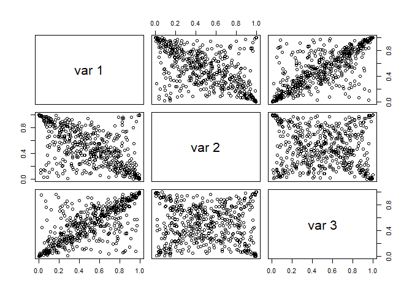
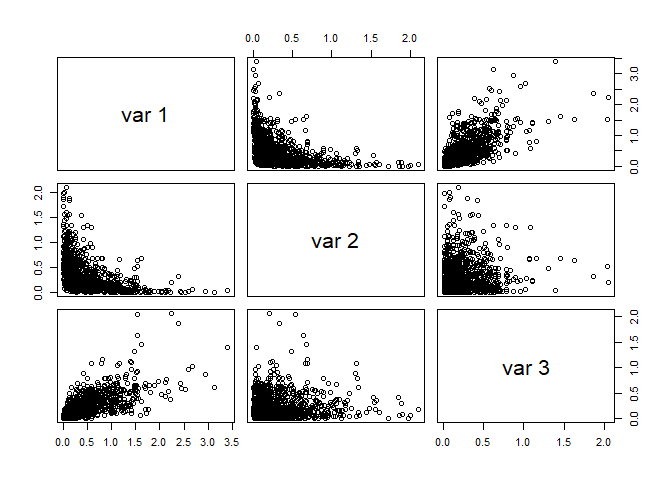
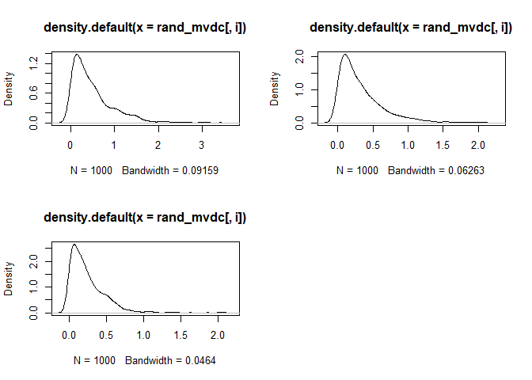
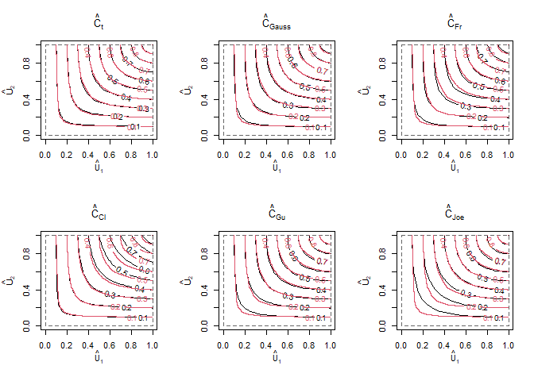
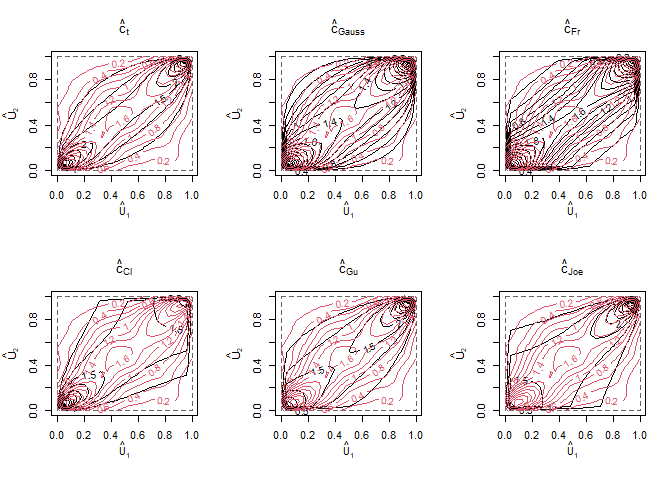

Statatistics and Data Analysis for Financial Engineering - Chapter 8
Copulas
================

``` r
library(copula)
cop_t_dim3 = tCopula(dim=3, param=c(-0.6,0.75,0), dispstr="un", df=1)
set.seed(5640)
rand_t_cop = rCopula(n=500, copula=cop_t_dim3)
pairs(rand_t_cop)
```

<!-- -->

``` r
cor(rand_t_cop)
```

    ##            [,1]        [,2]        [,3]
    ## [1,]  1.0000000 -0.54999514  0.70707296
    ## [2,] -0.5499951  1.00000000 -0.06538499
    ## [3,]  0.7070730 -0.06538499  1.00000000

### Problem1:  

1.  What copula model has been sampled? Give the correlation matrix?  

t-copula, degrees of freedom 1, correlation matrix is:

``` r
cor = matrix(1:9, nrow = 3, ncol = 3)
cor[1,] = c(1, -0.6, 0.75)
cor[2,] = c(-0.6, 1, 0)
cor[3,] = c(0.75, 0, 1)
print(cor)
```

    ##       [,1] [,2] [,3]
    ## [1,]  1.00 -0.6 0.75
    ## [2,] -0.60  1.0 0.00
    ## [3,]  0.75  0.0 1.00

2.  What is the sample size? 500  

### problem 2: scatterplot: 

1.  Components 2 and 3 are uncorrelated. Do they appear independent?
    Why?

A: The scatterplots would have been uniformly distributed if they where
independent, which they are not.   

2.  Do you see signs of tail dependence? Where?  

A: The non-uniformity mentioned in (a) is that there are more data in
the corners, which shows that extreme values tend to occur together,
although because of the zero correlation, a positive extreme value of
one component is equally likely to be paired with a positive or negative
extreme value of the other component.    

3.  What are theeffects of dependence upon the plots?  

A: The effects of tail dependence is the tendency of extreme values to
pair. The negative correlation of components 1 and 2 shows in the
concentration of the data along the diagonal from upper left to lower
right. Positive extreme values in one component tend to pair with
negative extreme values of ther other component.  
The positive correlation of components 2 and 3 shows in the
concentration of the data along the diagonal from lower left to upper
right. Positive extreme values in one component tend to pair with
positive extreme values of ther other component \\

4.  The nonzero correlations in the copula do not have the same values
    as the corresponding sample correlations. Why? If it is not random
    variation, what is it? Hint: get confidence intervals for Pearson
    correlations with:

``` r
cor.test(rand_t_cop[,1], rand_t_cop[,3])
```

    ## 
    ##  Pearson's product-moment correlation
    ## 
    ## data:  rand_t_cop[, 1] and rand_t_cop[, 3]
    ## t = 22.314, df = 498, p-value < 2.2e-16
    ## alternative hypothesis: true correlation is not equal to 0
    ## 95 percent confidence interval:
    ##  0.6603249 0.7483624
    ## sample estimates:
    ##      cor 
    ## 0.707073

which gives 95% CI for component 1 and 3. Does this CI include 0.75?  

A: The confidence interval is (0.6603, 0.7484) which does not quite
include 0.75. This is not surprising. 0.75 is the correlation between
the t-distributed random variables that define the copula and need not
be the same as the uniformly-distributed variables in the copula itself.
\\

### problem 3: Simulation from copula models

1 Define a gauss-copula, 2. define multivariate distribution by
specifying g-copula and marginal pdf. 3. generate random sample from the
multivariate pdf.

``` r
library(copula)
cop_t_dim3 = tCopula(dim = 3, param = c(-0.6,0.75,0), 
                     dispstr = "un", df = 1)
set.seed(5640)
rand_t_cop = rCopula(n = 500, copula = cop_t_dim3)
pairs(rand_t_cop)
```

<!-- -->

``` r
cor(rand_t_cop)
```

    ##            [,1]        [,2]        [,3]
    ## [1,]  1.0000000 -0.54999514  0.70707296
    ## [2,] -0.5499951  1.00000000 -0.06538499
    ## [3,]  0.7070730 -0.06538499  1.00000000

``` r
cor.test(rand_t_cop[,1],rand_t_cop[,3])
```

    ## 
    ##  Pearson's product-moment correlation
    ## 
    ## data:  rand_t_cop[, 1] and rand_t_cop[, 3]
    ## t = 22.314, df = 498, p-value < 2.2e-16
    ## alternative hypothesis: true correlation is not equal to 0
    ## 95 percent confidence interval:
    ##  0.6603249 0.7483624
    ## sample estimates:
    ##      cor 
    ## 0.707073

``` r
cop_normal_dim3 = normalCopula(dim = 3, param = c(-0.6,0.75,0), 
                               dispstr = "un")
mvdc_normal = mvdc(copula = cop_normal_dim3, margins = rep("exp",3),
                   paramMargins = list(list(rate=2), list(rate=3), 
                                       list(rate=4)))
set.seed(5640)
rand_mvdc = rMvdc(n = 1000, mvdc = mvdc_normal)
pairs(rand_mvdc)
```

<!-- -->

``` r
par(mfrow = c(2,2))
for(i in 1:3) plot(density(rand_mvdc[,i]))
for(i in 1:3) print(mean(rand_mvdc[,i]))
```

    ## [1] 0.499206
    ## [1] 0.3357976
    ## [1] 0.2479008

<!-- -->

1.  What are the marginal distributions of the three components in
    rand_mvdc? What are their expected values?

A: They look Beta distributed. Expected values: 0.5, 0.34, 0.25

2.  Are the second and third components independent? Why?

A: The scatterplots would have been uniformly distributed if they where
independent, which they are not.   

### Problem 4: Fitting Copula Models to Bivariate Return Data - IBM and S&P 500 - kendalls tau

``` r
# Data download 9/9/2014
# library(quantmod)
# getSymbols(c("IBM", "^GSPC"), from="2004-06-01",to="2014-05-31") 
# IBM.SP500 = cbind(IBM[,6],GSPC[,6]) ; head(IBM.SP500)
# netReturns = ((diff(IBM.SP500)/lag(IBM.SP500)*100)[-1,]) ; tail(netReturns)
# colnames(netReturns) = c("IBM", "SP500") ; colnames(netReturns)
# head(netReturns) ; tail(netReturns)
# write.zoo(netReturns,"IBM_SP500_04_14_daily_netRtns.csv", index.name="Date", sep=",")

library(MASS)     #  for fitdistr() and kde2d() functions
library(copula)   #  for copula functions
library(fGarch)   #  for standardized t density
netRtns = read.csv("datasets/IBM_SP500_04_14_daily_netRtns.csv", header = T)
ibm = netRtns[,2]
sp500 = netRtns[,3]
est.ibm = as.numeric( fitdistr(ibm,"t")$estimate )
est.sp500 = as.numeric( fitdistr(sp500,"t")$estimate )
est.ibm[2] = est.ibm[2] * sqrt( est.ibm[3] / (est.ibm[3]-2) )
est.sp500[2] = est.sp500[2] * sqrt(est.sp500[3] / (est.sp500[3]-2) )


cor_tau = cor(ibm, sp500, method = "kendall")
print(cor_tau)
```

    ## [1] 0.4952709

``` r
omega = sin((pi/2)*cor_tau) #0.5 ######### need to get correct value   

cop_t_dim2 = tCopula(omega, dim = 2, dispstr = "un", df = 4)

data1 = cbind(pstd(ibm, est.ibm[1], est.ibm[2], est.ibm[3]), 
              pstd(sp500, est.sp500[1], est.sp500[2], est.sp500[3]))
n = nrow(netRtns) ; n
```

    ## [1] 2516

``` r
data2 = cbind(rank(ibm)/(n+1), rank(sp500)/(n+1))
ft1 = fitCopula(cop_t_dim2, data1, method="ml", start=c(omega,4) ) 
ft2 = fitCopula(cop_t_dim2, data2, method="ml", start=c(omega,4) ) 
```

Q: Find value for Omega.

A: omega = sin((pi/2)\*cor_tau) = 0.7018346

### Problem 5 - Spearmans rank correlation

1.  Explain the difference between ft1 and ft2

A: Both fits are by pseudo-likelihood. ft1 is the parametric approach
because the univariate marginal distributions are estimated by fitting
t-distributions, and ft2 is the nonparametric approach because the
univariate distributions are estimated by empirical CDFs.

2.  Do the two estimates seeem significatly different?

A The two estimates of the correlation are 0.7022 and 0.7031. The two
estimates of the degrees of freedom are 2.98 and 3.02. Thus, the two
estimates of the copula are quite similar with no significant practical
difference. Notice also that the two estimates of the correlation are
similar to the estimate, 0.7018, in Problem 3 that used Kendall’s tau

### problem 6:

``` r
mvdc_t_t = mvdc( cop_t_dim2, c("std","std"), list(
           list(mean=est.ibm[1],sd=est.ibm[2],nu=est.ibm[3]),
           list(mean=est.sp500[1],sd=est.sp500[2],nu=est.sp500[3])))


# Will run for 1. minute or more
#fit_cop = fitMvdc(cbind(ibm,sp500),mvdc_t_t,start=c(ft1@estimate,est.ibm,est.sp500), hideWarnings=FALSE)
#print(fit_cop)

start = c(est.ibm, est.sp500, ft1@estimate)
objFn = function(param) -loglikMvdc(param,cbind(ibm,sp500),mvdc_t_t)
tic = proc.time()
ft = optim(start, objFn, method="L-BFGS-B",
           lower = c(-.1,0.001,2.2, -0.1,0.001,2.2,  0.2,2.5),
           upper = c( .1,   10, 15,  0.1,   10, 15,  0.9, 15) )
toc = proc.time()
total_time = toc - tic ; total_time[3]/60
```

    ## elapsed 
    ##  0.5715

``` r
print(total_time)
```

    ##    user  system elapsed 
    ##   34.25    0.00   34.29

``` r
print(ft)
```

    ## $par
    ## [1] 0.06504701 1.37982781 3.35792653 0.07422142 1.80751161 2.33415929 0.70421613
    ## [8] 2.96934977
    ## 
    ## $value
    ## [1] 6828.219
    ## 
    ## $counts
    ## function gradient 
    ##       64       64 
    ## 
    ## $convergence
    ## [1] 0
    ## 
    ## $message
    ## [1] "CONVERGENCE: REL_REDUCTION_OF_F <= FACTR*EPSMCH"

Lower and upper bounds are used to constrain the algorithm to search
where log-likeliehood is defined and finite. FitMvdc() does not allow to
define lower and upper bound and did not converge on this problem.

1.  What are the estimates of the copula parameters in fit_cop?

A:

> fit_cop = fitMvdc(cbind(ibm,sp500),mvdc_t_t,start=c(ft1@estimate,est.ibm,est.sp500), hideWarnings=FALSE) 
Error in optim(start, loglikMvdc, mvdc = mvdc, x = data, method = method,  : 
  initial value in 'vmmin' is not finite
In addition: Warning messages:
1: In sqrt(nu/(nu - 2)) : NaNs produced
2: In sqrt(nu/(nu - 2)) : NaNs produced
3: In sqrt(nu/(nu - 2)) : NaNs produced
4: In sqrt(nu/(nu - 2)) : NaNs produced

2.  What are the estimates of the parameters in the univariate marginal
    distribution?

A:

3.  Was the estimation method maximum likelihood, semiparametric pseudo
    ml, or parametric pseudo-ml?

4.  Estimate the coefficient of lower tail dependence for this copula.

### Problem 7:

``` r
fnorm = fitCopula(copula = normalCopula(dim=2), data=data1, method="ml" ) 
ffrank = fitCopula(copula = frankCopula(3, dim = 2), data = data1, method = "ml" )
fclayton = fitCopula(copula = claytonCopula(1, dim=2), data = data1, method = "ml" ) 
fgumbel = fitCopula(copula = gumbelCopula(3, dim=2), data = data1, method = "ml" ) 
fjoe = fitCopula(copula=joeCopula(2,dim=2),data=data1,method="ml" ) 
```

The estimated copulas (CDFs) will be compared with the empirical copulas

``` r
Udex = (1:n)/(n+1)

#Cn: The Empirical Copula
tmp_u = cbind(rep(Udex,n),rep(Udex,each=n))
#Cn = C.n(u=tmp_u, U=data1, method="C")
Cn = C.n(tmp_u, data1)

EmpCop = expression(contour(Udex, Udex, matrix(Cn, n, n), col = 2, add = TRUE))
par(mfrow=c(2,3))
contour(tCopula(param=ft$par[7],dim=2,df=round(ft$par[8])), 
        pCopula, main = expression(hat(C)[t]), mgp = c(2.5,1,0), 
        xlab = expression(hat(U)[1]), ylab = expression(hat(U)[2]) )
eval(EmpCop)
contour(normalCopula(param=fnorm@estimate[1], dim = 2), 
        pCopula, main = expression(hat(C)[Gauss]), mgp = c(2.5,1,0),
        xlab = expression(hat(U)[1]), ylab = expression(hat(U)[2]) )
eval(EmpCop)
contour(frankCopula(param=ffrank@estimate[1], dim = 2), 
        pCopula, main = expression(hat(C)[Fr]), mgp = c(2.5,1,0),
        xlab = expression(hat(U)[1]), ylab = expression(hat(U)[2]) )
eval(EmpCop)
contour(claytonCopula(param=fclayton@estimate[1], dim = 2), 
        pCopula, main = expression(hat(C)[Cl]), mgp = c(2.5,1,0),
        xlab = expression(hat(U)[1]), ylab = expression(hat(U)[2]) )
eval(EmpCop)
contour(gumbelCopula(param=fgumbel@estimate[1], dim = 2), 
        pCopula, main = expression(hat(C)[Gu]), mgp = c(2.5,1,0),
        xlab = expression(hat(U)[1]), ylab = expression(hat(U)[2]) )
eval(EmpCop)
contour(joeCopula(param=fjoe@estimate[1], dim = 2), 
        pCopula, main = expression(hat(C)[Joe]), mgp = c(2.5,1,0),
        xlab = expression(hat(U)[1]), ylab = expression(hat(U)[2]) )
eval(EmpCop)
```

<!-- -->

### Problem 8

A 2-d KDE of the copulas density will be compared with the parametric
density estimate (PDFs)

``` r
par(mfrow=c(2,3))
contour(tCopula(param=ft$par[7],dim=2,df=round(ft$par[8])),
        dCopula, main = expression(hat(c)[t]), mgp = c(2.5,1,0), 
  nlevels=25, xlab=expression(hat(U)[1]),ylab=expression(hat(U)[2]))
contour(kde2d(data1[,1],data1[,2]), col = 2, add = TRUE)
contour(normalCopula(param=fnorm@estimate[1], dim = 2), 
        dCopula, main = expression(hat(c)[Gauss]), mgp = c(2.5,1,0),
  nlevels=25, xlab=expression(hat(U)[1]),ylab=expression(hat(U)[2]))
contour(kde2d(data1[,1],data1[,2]), col = 2, add = TRUE)
contour(frankCopula(param=ffrank@estimate[1], dim = 2), 
        dCopula, main = expression(hat(c)[Fr]), mgp = c(2.5,1,0),
  nlevels=25, xlab=expression(hat(U)[1]),ylab=expression(hat(U)[2]))
contour(kde2d(data1[,1],data1[,2]), col = 2, add = TRUE)
contour(claytonCopula(param=fclayton@estimate[1], dim = 2), 
        dCopula, main = expression(hat(c)[Cl]), mgp = c(2.5,1,0),
  nlevels=25, xlab=expression(hat(U)[1]),ylab=expression(hat(U)[2]))
contour(kde2d(data1[,1],data1[,2]), col = 2, add = TRUE)
contour(gumbelCopula(param=fgumbel@estimate[1], dim = 2), 
        dCopula, main = expression(hat(c)[Gu]), mgp = c(2.5,1,0),
  nlevels=25, xlab=expression(hat(U)[1]),ylab=expression(hat(U)[2]))
contour(kde2d(data1[,1],data1[,2]), col = 2, add = TRUE)
contour(joeCopula(param=fjoe@estimate[1], dim = 2), 
        dCopula, main = expression(hat(c)[Joe]), mgp = c(2.5,1,0),
  nlevels=25, xlab=expression(hat(U)[1]),ylab=expression(hat(U)[2]))
contour(kde2d(data1[,1],data1[,2]), col = 2, add = TRUE)
```

<!-- -->

1.  Do you see any difference between the parametric estimates of the
    copula density? If so, which seem closest to the KDE?

### Problem 9

1.  Find AIC for t, gauss, frank, clayton, gumbel and joe copulas. Which
    copula models fit best by AIC? Hint: the fitCopula() returns
    log-likelihood.

## Exercises

1.  Kedalls tau rank correlation between X, and Y is 0.55. Both X and Y
    are positive. What is kendalls tau between X and 1/Y? What is
    kendalls tau between 1/X and 1/Y?

A: A monotonically strictly decreasing transformation of one variable
will change concordant pairs to discordant pairs and vice versa, so it
will change the sign but not the magnitude of Kendall’s tau. Since Y →
1/Y is monotonicity strictly decreasing, Kendall’s tau between X and 1/Y
is −0.55 and Kendall’s tau between 1/X and 1/Y is 0.55.

2.  Suppose that X is U(0,1) and Y=X^2. Then the Spearman rank
    correlation and Kendalls tau between X and Y will both equal 1, but
    the Pearson correlation between X and Y will be les than 1. Why?

A:

3.  Show that Archimedean copula with generator function
     ) = -ln(u)")
    is equal to the independenct copula
    . Does the
    same hold when the natural logarithm is replaced by the common
    logarithm?

A:

4.  

…

10. Suppose
    ")
    has the meta-Gauss distribution with continous marginal distribution
    and copula
    ").
    Show that
    ")=0
    then  and
     are
    independent.

A: By (8.27),
 = 0"),
so the copula of (Y_j, Y_k)$ is the copula of a bivariate Gaussian
distribution with correlation matrix equal to the identity matrix. This
distribution has independent components so the copula of
")
is the independence copula with density identically equal to 1, that is,
 = 1").
Therefore, the components of Y are independent, because, for example,
(8.4) implies that

 = c_Y( F_Y_j(y_j), F_Y_k(y_k)}f_Y_j(y_j),f_Y_k(y_k) ) = f_Y_j(y_j)f_Y_k(y_k)")

which shows that 
and  are
independent.
